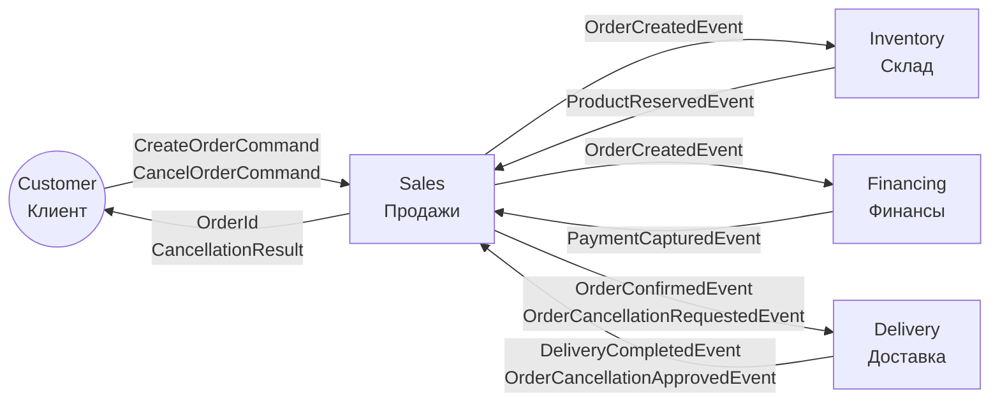

```mermaid
graph LR
    Customer((Customer<br/>Клиент))

    Sales[Sales<br/>Продажи]
    Inventory[Inventory<br/>Склад]
    Financing[Financing<br/>Финансы]
    Delivery[Delivery<br/>Доставка]

    Customer -->|"CreateOrderCommand<br/>CancelOrderCommand"| Sales
    Sales -->|"OrderId<br/>CancellationResult"| Customer

    Sales -->|"OrderCreatedEvent"| Inventory
    Sales -->|"OrderCreatedEvent"| Financing

    Inventory -->|"ProductReservedEvent"| Sales
    Financing -->|"PaymentCapturedEvent"| Sales

    Sales -->|"OrderConfirmedEvent<br/>OrderCancellationRequestedEvent"| Delivery

    Delivery -->|"DeliveryCompletedEvent<br/>OrderCancellationApprovedEvent"| Sales
```