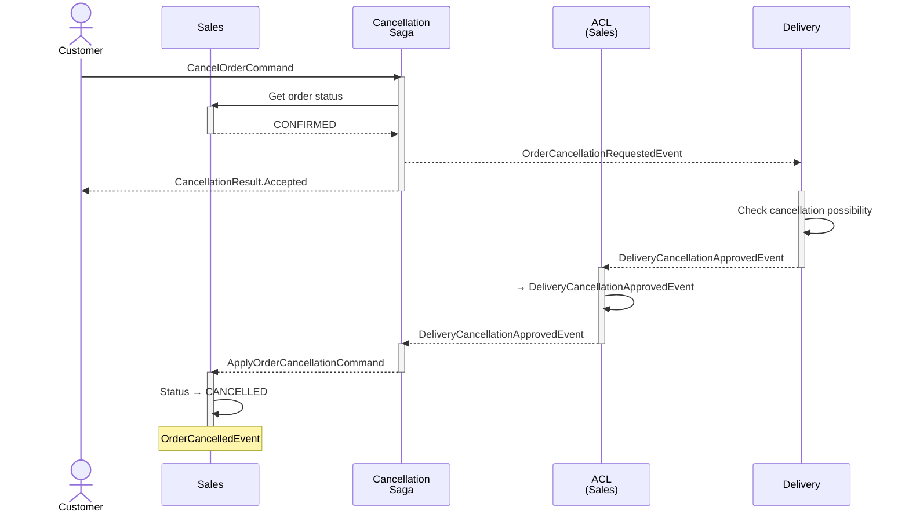

```mermaid
sequenceDiagram
    actor Customer
    participant Sales as Sales
    participant SAGA as Cancellation<br/>Saga
    participant ACL as ACL<br/>(Sales)
    participant Delivery

    Customer->>SAGA: CancelOrderCommand
    activate SAGA
    SAGA->>Sales: Get order status
    activate Sales
    Sales-->>SAGA: CONFIRMED
    deactivate Sales
    SAGA-->>Delivery: OrderCancellationRequestedEvent
    SAGA-->>Customer: CancellationResult.Accepted
    deactivate SAGA

    activate Delivery
    Delivery->>Delivery: Check cancellation possibility
    Delivery-->>ACL: DeliveryCancellationApprovedEvent
    deactivate Delivery

    activate ACL
    ACL->>ACL: → DeliveryCancellationApprovedEvent
    ACL-->>SAGA: DeliveryCancellationApprovedEvent
    deactivate ACL

    activate SAGA
    SAGA-->>Sales: ApplyOrderCancellationCommand
    deactivate SAGA

    activate Sales
    Sales->>Sales: Status → CANCELLED
    Note over Sales: OrderCancelledEvent
    deactivate Sales
```