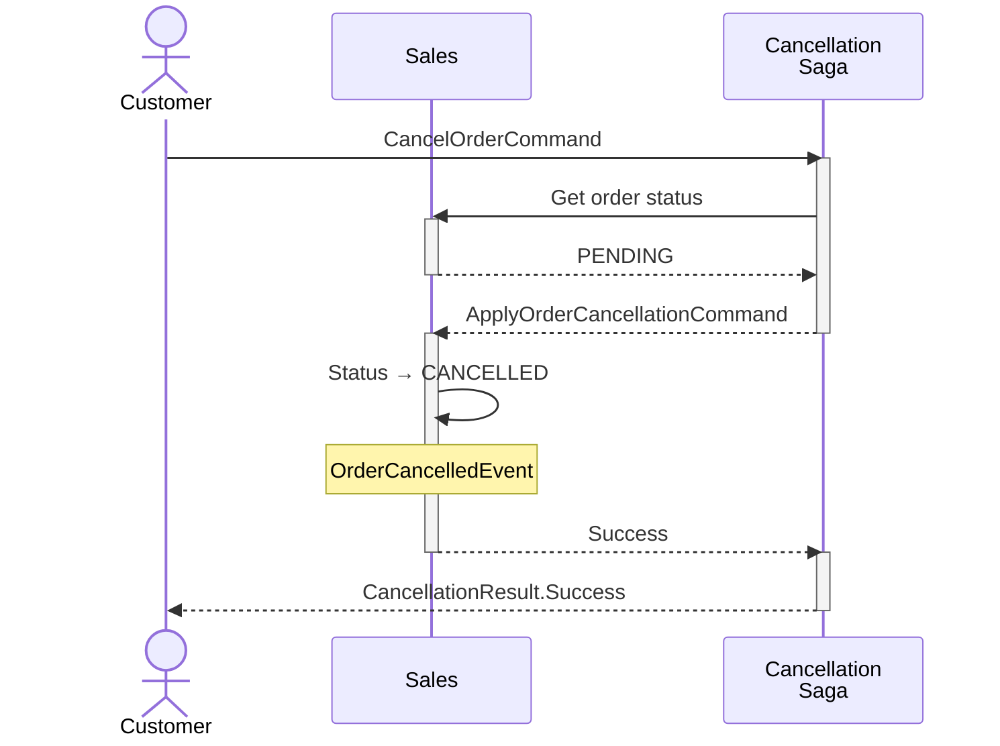

```mermaid
sequenceDiagram
    actor Customer
    participant Sales as Sales
    participant SAGA as Cancellation<br/>Saga

    Customer->>SAGA: CancelOrderCommand
    activate SAGA
    SAGA->>Sales: Get order status
    activate Sales
    Sales-->>SAGA: PENDING
    deactivate Sales
    SAGA-->>Sales: ApplyOrderCancellationCommand
    deactivate SAGA

    activate Sales
    Sales->>Sales: Status → CANCELLED
    Note over Sales: OrderCancelledEvent
    Sales-->>SAGA: Success
    deactivate Sales

    activate SAGA
    SAGA-->>Customer: CancellationResult.Success
    deactivate SAGA
```