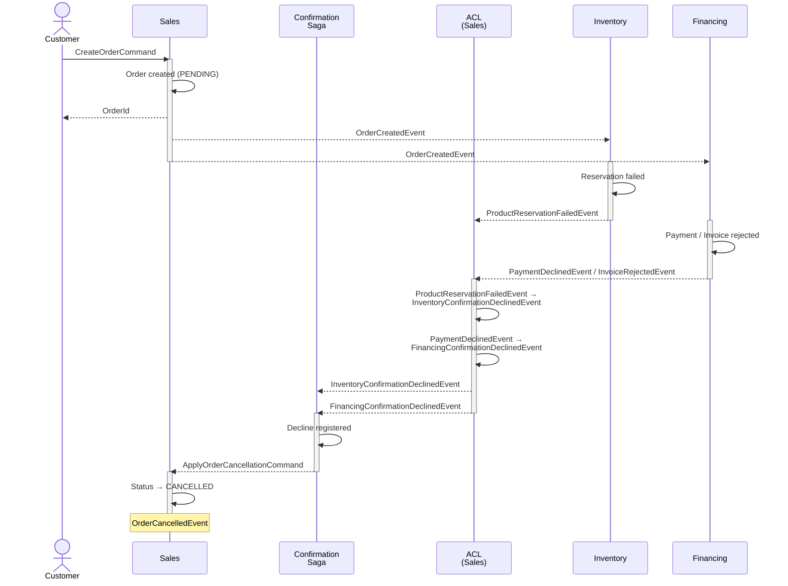

```mermaid
sequenceDiagram
    actor Customer
    participant Sales as Sales
    participant SAGA as Confirmation<br/>Saga
    participant ACL as ACL<br/>(Sales)
    participant Inventory
    participant Financing

    Customer->>Sales: CreateOrderCommand
    activate Sales
    Sales->>Sales: Order created (PENDING)
    Sales-->>Customer: OrderId
    Sales-->>Inventory: OrderCreatedEvent
    Sales-->>Financing: OrderCreatedEvent
    deactivate Sales

    activate Inventory
    Inventory->>Inventory: Reservation failed
    Inventory-->>ACL: ProductReservationFailedEvent
    deactivate Inventory

    activate Financing
    Financing->>Financing: Payment / Invoice rejected
    Financing-->>ACL: PaymentDeclinedEvent / InvoiceRejectedEvent
    deactivate Financing

    activate ACL
    ACL->>ACL: ProductReservationFailedEvent →<br/>InventoryConfirmationDeclinedEvent
    ACL->>ACL: PaymentDeclinedEvent →<br/>FinancingConfirmationDeclinedEvent
    ACL-->>SAGA: InventoryConfirmationDeclinedEvent
    ACL-->>SAGA: FinancingConfirmationDeclinedEvent
    deactivate ACL

    activate SAGA
    SAGA->>SAGA: Decline registered
    SAGA-->>Sales: ApplyOrderCancellationCommand
    deactivate SAGA

    activate Sales
    Sales->>Sales: Status → CANCELLED
    Note over Sales: OrderCancelledEvent
    deactivate Sales
```