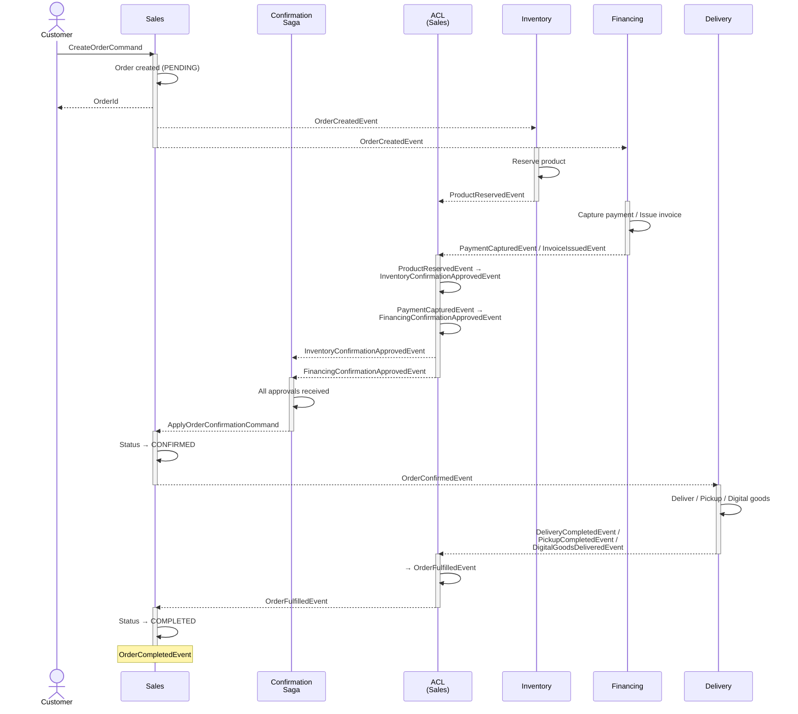

```mermaid
sequenceDiagram
    actor Customer
    participant Sales as Sales
    participant SAGA as Confirmation<br/>Saga
    participant ACL as ACL<br/>(Sales)
    participant Inventory
    participant Financing
    participant Delivery

    Customer->>Sales: CreateOrderCommand
    activate Sales
    Sales->>Sales: Order created (PENDING)
    Sales-->>Customer: OrderId
    Sales-->>Inventory: OrderCreatedEvent
    Sales-->>Financing: OrderCreatedEvent
    deactivate Sales

    activate Inventory
    Inventory->>Inventory: Reserve product
    Inventory-->>ACL: ProductReservedEvent
    deactivate Inventory

    activate Financing
    Financing->>Financing: Capture payment / Issue invoice
    Financing-->>ACL: PaymentCapturedEvent / InvoiceIssuedEvent
    deactivate Financing

    activate ACL
    ACL->>ACL: ProductReservedEvent →<br/>InventoryConfirmationApprovedEvent
    ACL->>ACL: PaymentCapturedEvent →<br/>FinancingConfirmationApprovedEvent
    ACL-->>SAGA: InventoryConfirmationApprovedEvent
    ACL-->>SAGA: FinancingConfirmationApprovedEvent
    deactivate ACL

    activate SAGA
    SAGA->>SAGA: All approvals received
    SAGA-->>Sales: ApplyOrderConfirmationCommand
    deactivate SAGA

    activate Sales
    Sales->>Sales: Status → CONFIRMED
    Sales-->>Delivery: OrderConfirmedEvent
    deactivate Sales

    activate Delivery
    Delivery->>Delivery: Deliver / Pickup / Digital goods
    Delivery-->>ACL: DeliveryCompletedEvent /<br/>PickupCompletedEvent /<br/>DigitalGoodsDeliveredEvent
    deactivate Delivery

    activate ACL
    ACL->>ACL: → OrderFulfilledEvent
    ACL-->>Sales: OrderFulfilledEvent
    deactivate ACL

    activate Sales
    Sales->>Sales: Status → COMPLETED
    Note over Sales: OrderCompletedEvent
    deactivate Sales
```